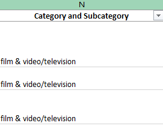
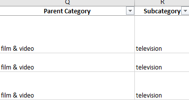
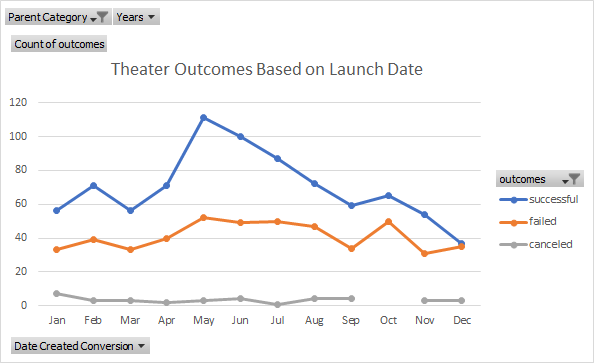
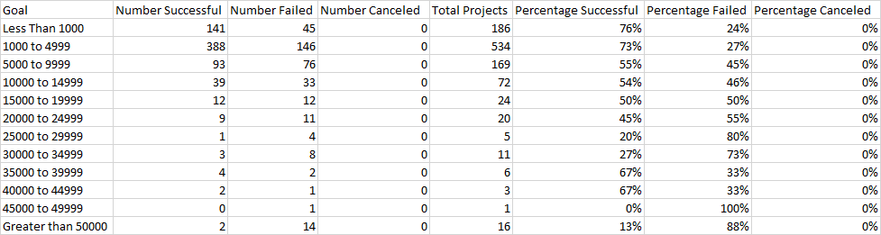
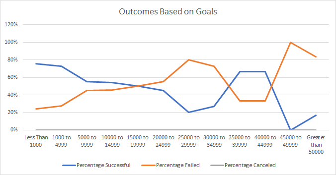
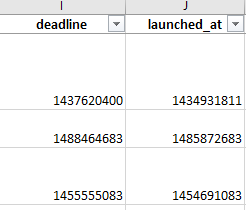
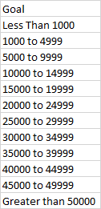

# Kickstarting with Excel

## Overview of Project

Louise has started a Kickstarter campaign to fund her play *Fever*.  The campaign quickly came close to reaching its fundraising goal. The purpose of the following analysis is to provide Louise with insights into other kickstarter campaigns' success based on launch dates and fundraising goals.  The analysis was performed on data in an excel spreadsheet for several kickstarter campaigns.  The data for each campaign included details such as Project Name, goal and pledged amounts, country in which the campaign took place, the outcome of the campaign, the launch and deadline dates, and category and subcategory of the project in the campaign.  

## Analysis and Challenges

In doing this analysis, I first examined how the time of year Kickstarter campaigns launched affected the out come of the campaigns.  Second I focused on how the amount of the campaign goals affected the outcomes.  

I focused on projects in the **theater** category.  The original data set listed category and subcategory in the same column. 

.  

I added additional columns to the spreadsheet and used the Text to Columns feature to split the category and subcategory information into the columns *Parent Category* and *Subcategory*.  

### Analysis of Outcomes Based on Launch Date

In order to examine how launch date affected the outcomes of Theater projects, I created a pivot table from the full data set. 

I filtered the table to display only projects in the Theater Parent Category.  The month in which campaigns launched regardless of year are listed in the rows of the table, while the outcomes Successful, Failed, and Canceled are the column headers.  The values in the table show the count of Successful, Failed, and Canceled campaigns launched in each month of the year.  From this table I then created a chart to quickly visualize how the outcomes of campaigns differ throughout the year.  

### Analysis of Outcomes Based on Goals

I then focused on how the amount of a campaign goal affected the campaign outcome.  I added a new worksheet to the workbook and created a table with ranges for the dollar goal amount of campaigns.  

I used the CountIfs function to populate the 'Number Successful', 'Number Failed', and 'Number Canceled' columns of the table.  For a given cell of the table, a campaign from the original data set in the Kickstarter Analysis worksheet would be counted by the CountIfs function if: it's goal fell within the range listed on that row, it's outcome matched the column, and the project's subcategory was *Plays*.  I then used these totals to calculate the percentage of campaigns within each range that were Successful, Failed, or were Canceled.  I created a chart to visualize the percentage of each outcome as goal amount increased to shed insight on how the goal amount would influence a project's success.

### Challenges and Difficulties Encountered

The first issue in doing the analysis was that the dates for campaign launches and deadlines in columns I and J of the original spreadsheet were listed as unix timestamps rather than readable dates.

  

In order to analyze the effect of launch date on campaign outcomes, I first used the Date function to convert the timestamps to readable dates.

Another challenge arose in creating the table for the analysis of outcomes based on goals.  Because of how many ranges the goal amounts were split into, it became easy to make mistakes in typing the ranges into the row lables-either mislabelling a row or omitting a desired range.  

Similarly, the length of the CountIfs function used, and the number of times required to input it according to the different ranges allowed for similar mistakes, accidentally inputing ">" rather than ">=" when trying correspond to the ranges.  

Both mistakes could result in campaigns being counted in the wrong range, or being omitted from the counts all together.  In order to check the accuracey of the table, I summed the total Number of campaigns for each outcome in the table.  Then, on the original worksheet, I filtered the subcategory for Plays, then for each outcome one at a time, and counted the number of campaigns shown after filtering.  If the totals did not match, I would trouble shoot to see where the error in my table was.

## Results

- What are two conclusions you can draw about the Outcomes based on Launch Date?

The Outcomes based on Launch Date analysis showed that a majority of Kickstarter campaigns for theater projects were successful regardless of the month in which the campaign was launched.  Furthermore, the number of successful campaigns increases substantially for projects launching in May and June, with the trend then tapering down through the remaining months of the year.  While the number of failed campaigns also increases in May, the increase in successfuly campaigns is much greater.  

I can thus conclude that while theater campaigns in general tend to be successful, those launched in May and June have the greatest chance of meeting their fundraising goals.  

Louise's project *Fever* launched in June, but it failed.  Because campaigns launched in June were typically more likely to succeed, I can also conclude that the launch date of Louise's campaign for *Fever* was not the reason the campaign failed.

- What can you conclude about the Outcomes based on Goals?

The analysis showed that campaigns in the Plays subcategory became less likely to succeed as the the fundraising goal increased, in fact becoming much more likely to fail as the goal increased, at least until the the goal amount reached $35,000 or more.  At this point outcomes become more inconsistent.  However, the number of campaigns who's goal was greater than $35,000 is very low compared to the number of campaigns below that amount, so it is difficult to draw conclusions about campaigns with large goals from such a small sample in that goal range.  

For campaigns with goals below $35,000, I can conclude that a campaign's chance of success greatly diminishes as its goal increases.  Louise's fundraising goal is within the lowest range analyzed, which should have given it a good chance of success, so the failure of Louise's campaign is likely not due to the goal amount.

- What are some limitations of this dataset?

This data set does not include any metrics about the popularity of the person or people launching each campaign.  For example, having more Twitter or Instagram followers may make a person more likely to attract backers for their campaigns and thus be more likely to meet their fundraising goal. 

Similarly, there are now metrics on how the campaign was advertised or how many people were aware of the campaign.  Knowing how prominently a campaign was advertised and how many page views each campaign had while active could provide insights into how many people need to know about a campaign in order for it to be successful.

- What are some other possible tables and/or graphs that we could create?

We could create tables 
